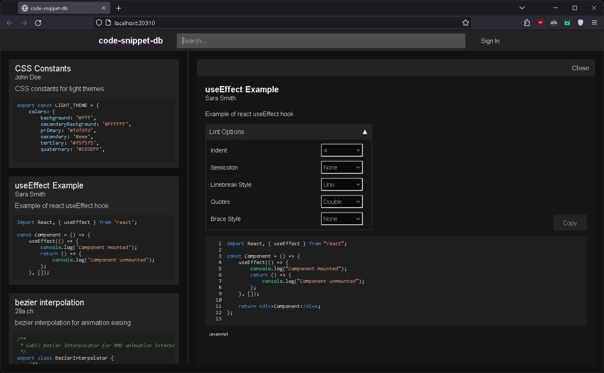

# code-snippet-db



simple code snippet database with eslint integration

## Features

- Add code snippets
- Search code snippets
- Lint code snippets with eslint

## Installation instructions

### Requirements

- Node.js
- npm
- mysql
- mailserver

### Run development server

for start server first set the environment variables in the `server/src/const.ts` and `server/src/secret.ts` files

then run the following commands
```bash
cd server
npm install
npm watch
```

for start client set the server url in the `src/constants/apolloClient.ts` file

then run the following commands
```bash
npm install
npm start
```

### Build production

for build production run the following commands
```bash
npm run build
cd server
npm run build
```
